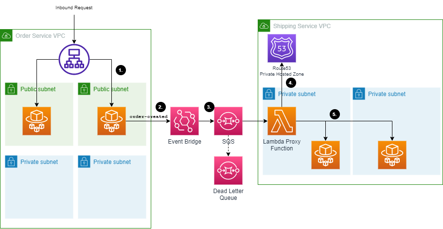

# Event Driven Archiecture with .NET API's

This sample project demonstrates how to build an event driven architecture on AWS using ECS Fargate, .NET 6 REST API's and AWS CoPilot. AWS Lambda requires a paradigm shift for developers, both in programming and deployment. Whilst Lambda is the recommended compute approach for event driven compute, it is still possible to build a serverless event driven application using REST API's.

## Architecture



1. A request is received to a public facing application load balancer. This request is routed to a task running on ECS Fargate.
2. The receiver process the request and publishes an order-created event to ECS Fargate.
3. An event bridge rule is deployed by the consumer that routes the event to an SQS queue. SQS is used here to provide backpressure if an unexpectedly high load of events come into the consumer
4. An AWS Lambda functions processes the inbound requests from the queue. A Route53 private hosted zone is used to provide DNS resolution to the internal service
5. The Lambda function POST's the event to the receiving API running on ECS Fargate.

The consumer is a private API deployed using an [AWS Copilot Backend Service](https://aws.github.io/copilot-cli/docs/concepts/services/#backend-service). This uses a Route53 private hosted zone to provide DNS resolution to individual containers running in ECS Fargate.

Using the [AWS Copilot Service Discovery](https://aws.github.io/copilot-cli/docs/developing/service-discovery/) mechanism provides a static, internal URL for accessing internal applications.

The Lambda proxy function is deployed into the same subnets as the ECS Tasks.

## Deployment

The two sample applications are built using a combination of [AWS Copilot](https://aws.github.io/copilot-cli/) for the application deployment to ECS and the [AWS CDK](https://aws.amazon.com/cdk/) for deploying infrastructure.

The consuming application uses a construct to allow a Lambda proxy to be deployed multiple times with different configuration options.

``` c#
var proxy = new LambdaProxy(this, "TestProxy", new LambdaProxyProps()
{
    ProxyIdentifier = "test-proxy",
    ForwardingUrl = "http://event-receiver.test.shipping-service.local:8080/receiver",
    EventBus = centralEventBus,
    EventPattern = new EventPattern()
    {
        Source = new[] { "order-service" },
    },
    Vpc = existingVpc,
    Subnets = new SubnetSelection()
    {
        Subnets = existingVpc.IsolatedSubnets
    }
});
```

TODO: Add instructions for deployment into a new AWS account

## Roadmap

[ ] Add instructions for self-service deployment
[ ] Add distributed tracing
